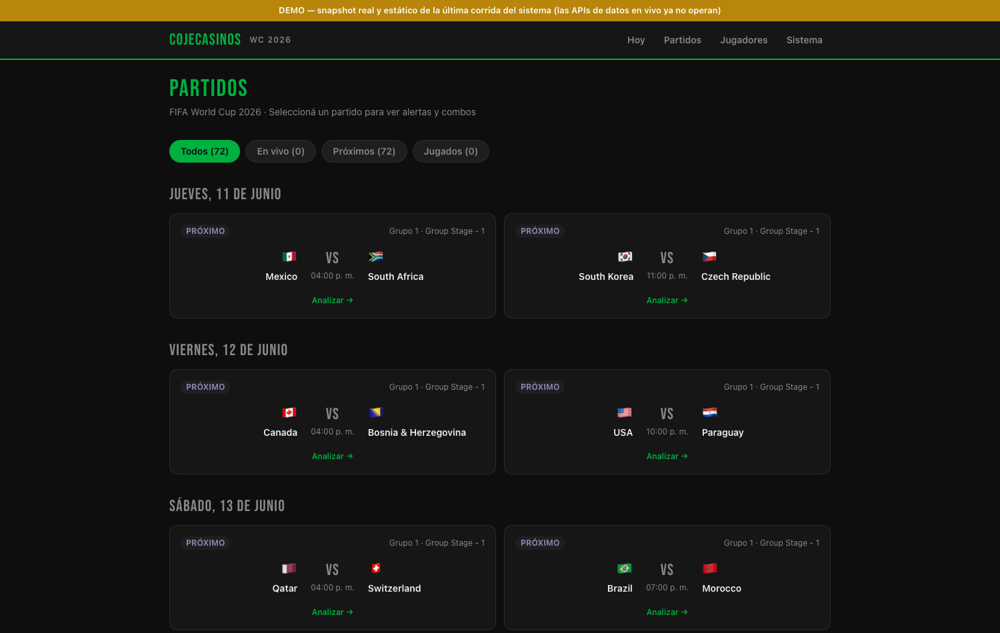
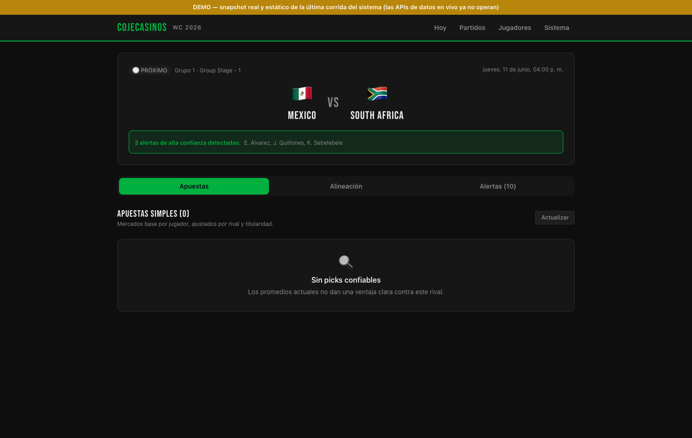

# CojeCasinos - WC2026 Betting Intelligence

AI-powered betting analytics for the FIFA World Cup 2026.

**▶ [Live demo](https://diegodiaz808.github.io/worldcup-betting/)** - static snapshot of the system's last real run (the live data APIs no longer operate).





## Stack
- Next.js 14 (App Router) + TypeScript
- Tailwind CSS (dark theme, gold accent)
- Prisma + SQLite (dev) / PostgreSQL (prod)
- Anthropic Claude Opus for AI combo generation

## Setup

```bash
npm install
cp .env.example .env
# Fill in your API keys in .env
npx prisma migrate dev
npm run dev
```

## Environment Variables

| Variable | Description |
|---|---|
| `DATABASE_URL` | SQLite: `file:./dev.db` · Postgres: `postgresql://...` |
| `FOOTBALL_API_KEY` | RapidAPI key for api-football-v1.p.rapidapi.com |
| `FOOTBALL_DATA_KEY` | football-data.org API key |
| `ANTHROPIC_API_KEY` | Anthropic API key (for AI combos) |

## API Key Guide

### API-Football (RapidAPI)
1. Sign up at https://rapidapi.com
2. Subscribe to "API-Football" (free tier: 100 req/day)
3. Copy the `X-RapidAPI-Key` header value → `FOOTBALL_API_KEY`

### football-data.org
1. Register at https://www.football-data.org/client/register
2. Free tier gives access to World Cup competition data
3. Copy the token from your dashboard → `FOOTBALL_DATA_KEY`

### Anthropic
1. Create account at https://console.anthropic.com
2. Generate an API key
3. Copy → `ANTHROPIC_API_KEY`

## Pages

| Route | Description |
|---|---|
| `/dashboard` | Player leaderboard with weighted scores, expandable cards |
| `/combos` | AI combo generator + history |

## Scoring Algorithm

```
score = (rating × 0.4) + (goalsPerMatch × 20 × 0.4) + (shotsOnTarget/matches × 0.2)
weightedScore = score_2months × 0.65 + score_6months × 0.35
```

## Cron Job
The app auto-syncs player data every 60 minutes via node-cron. Trigger manually via `POST /api/sync`.
